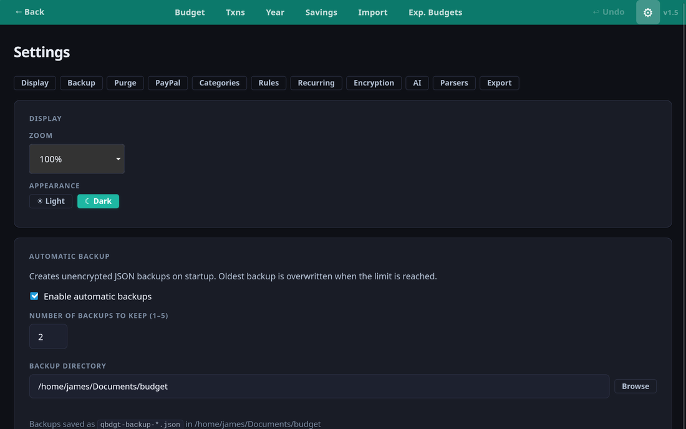
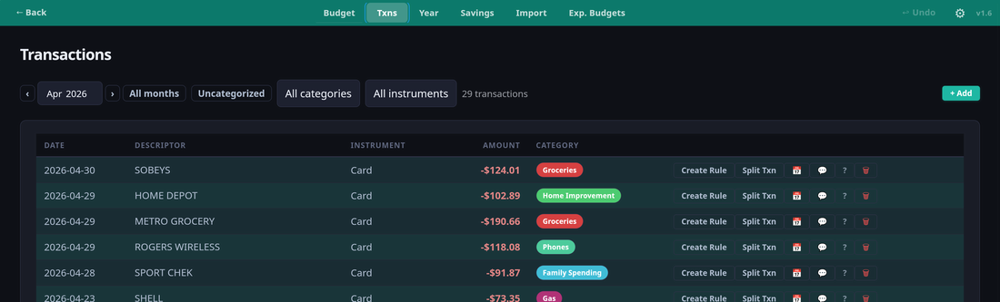
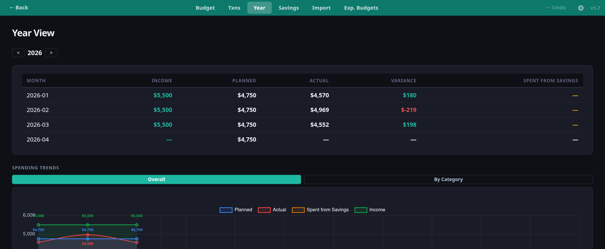
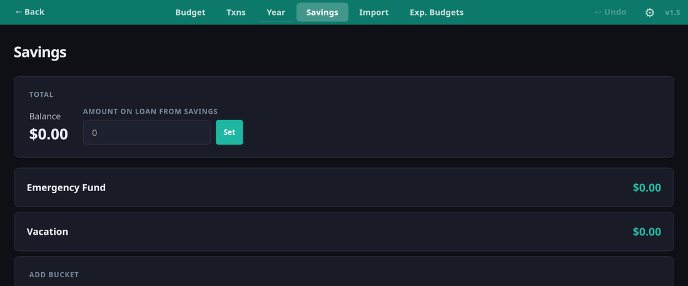
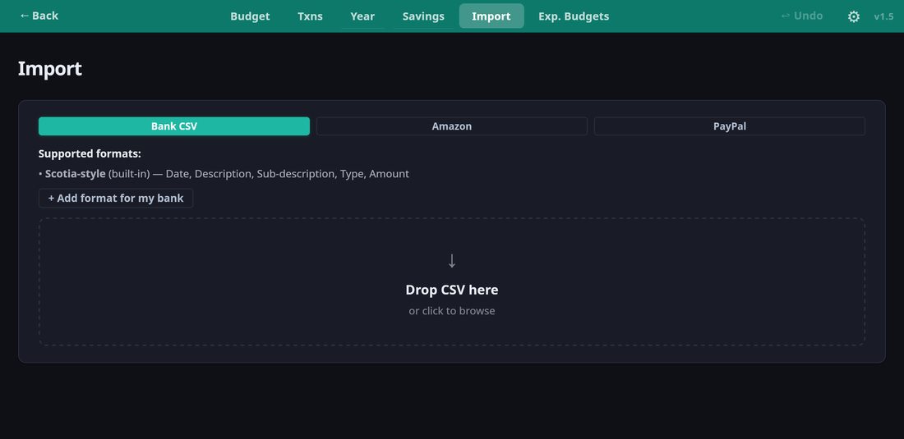
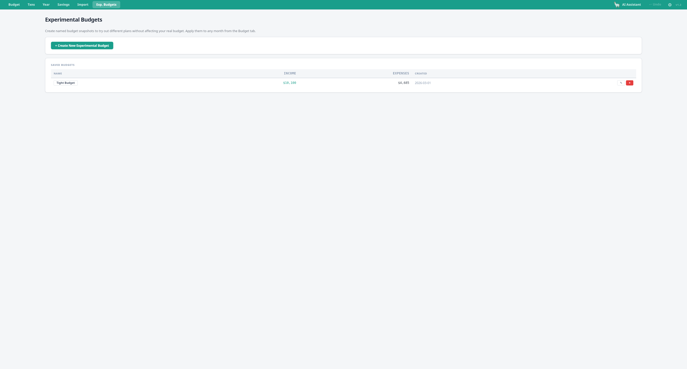
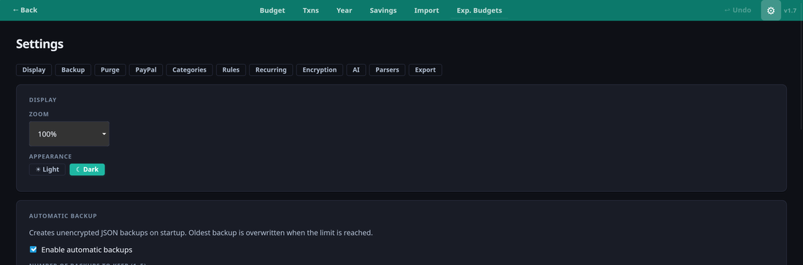

# qbdgt

A privacy-focused personal budgeting desktop app. Create monthly budgets, track spending, and see where your money actually goes — without ever giving your login credentials to a third party or uploading your data to the cloud.

**Your data never leaves your computer.** Everything is stored in a single local file you own and control. Optionally encrypt it with a password.

**[Download latest release →](https://github.com/Kll7Ordin/qbdgt/releases/latest)**



---

## Why qbdgt?

Most budgeting apps require you to hand over your bank login or connect via open banking APIs. qbdgt takes the opposite approach: you export a CSV from your bank and import it yourself. It takes an extra minute, but your credentials stay with you and your financial data stays on your machine.

- **No accounts.** No sign-up, no cloud sync, no third-party servers.
- **Single file.** Your entire budget lives in one JSON file — easy to back up, version, or move between machines.
- **Optional encryption.** Password-protect your data file with AES encryption.
- **Open source.** Runs as a native desktop app via [Tauri](https://tauri.app).

---

## Getting started

### Download

Grab the installer for your platform from the [latest release](https://github.com/Kll7Ordin/qbdgt/releases/latest):

- **Windows** — `.msi` or `.exe` installer
- **Linux** — `.deb` package or `.AppImage`

### First launch

On first launch you will be asked to open or create a budget file:

- **Open existing file** — open a `.json` budget file you already have.
- **Create new file** — start fresh with the default category template.
- **Try demo data** — load a pre-built demo budget to explore the app before entering your own data.

Choose a location for your file (a synced folder works well for cross-device access via your own cloud storage), set an optional password, and you are ready to go.

---

## Tabs

### Budget

Set monthly spending targets per category and track actual spending in real time.


- **Summary cards** — at a glance: total planned Expenses, expected Income, and Net (Income − Expenses). Month-to-date actuals show Spent, Remaining, Received income, and Yet to Receive.
- **Category groups** — organise categories into named groups (High Variable, Fixed Bills, Subscriptions, etc.) with group-level subtotals. Drag and drop to reorder groups and categories.
- **Per-row stats** — each category shows Target, Spent, Left, YTD total, YTD target, YTD variance, and average spend per month.
- **Progress bars** — visual spend-vs-target bar per category, coloured green (on track) or red (over budget).
- **Income section** — separate income rows showing Expected vs Received per income category.
- **Occasional group** — mark a group as "Occasional" (e.g. emergency fund spending); these rows are excluded from the regular monthly totals.
- **Copy from previous month** — populate a new month's targets from last month with one click.
- **Copy from Experimental Budget** — apply a saved scenario budget to any month.
- **Import Budget** — for brand-new files, import category targets from an XLSX spreadsheet directly from this tab.
- **Undo** — undo any change with Ctrl+Z.

---

### Transactions

View, categorise, and search all your transactions.



- **Transaction list** — date, descriptor, instrument (account), amount, and colour-coded category.
- **Filters** — filter by month, category, or uncategorised-only. Filter by instrument (account type).
- **Search** — press Ctrl+F to search transaction descriptors.
- **Auto-categorisation rules** — create keyword or regex rules (e.g. "LOBLAWS → Groceries") that apply automatically on import. Create a rule from any transaction row with one click.
- **Category suggestion chips** — history-based suggestions appear on each uncategorised transaction based on how you've categorised similar transactions before.
- **Deep dive (?)** — click `?` on any transaction to ask the local AI assistant about it (requires Ollama).
- **Split transactions** — split a single transaction across multiple categories with custom amounts and optional different dates.
- **Manual entry** — add transactions manually without importing a file.
- **Undo** — all categorisations and edits are undoable.

---

### Year View

See your full year at a glance.



- **Monthly table** — Income, Planned expenses, Actual expenses, Variance, and Spent from Savings for every month of the year.
- **Spending Trends chart** — line chart with Planned, Actual, Spent from Savings, and Income series. Data point labels shown without overlap.
- **By Category chart** — switch to a per-category breakdown to see which categories drove overruns each month.

---

### Savings

Track savings buckets and contribution schedules.



- **Multiple buckets** — create named buckets (Emergency Fund, Vacation, New Car, etc.) each with its own balance.
- **Total balance** — overall savings balance shown at the top.
- **Manual entries** — record deposits and withdrawals with optional notes.
- **Schedules** — set up recurring monthly contributions (e.g. $300 to Emergency Fund on the 1st of each month) so balances stay current automatically.
- **Loan tracking** — record amounts temporarily borrowed from savings to keep totals accurate.

---

### Import

Bring in transactions from your bank or other sources.



- **Bank CSV** — drop a CSV exported from your bank. Built-in support for:
  - **Scotia Chequing CSV** — Date, Description, Sub-description, Type of Transaction, Amount
  - **Scotia Credit Card CSV** — Date, Description, Sub-description, Amount (negative = credit)
  - **Custom formats** — add support for any bank by providing a sample file; the AI generates a parser (requires Ollama). Manage formats in Settings → Bank CSV Formats.
- **Amazon** — import from Amazon order history CSV export.
- **PayPal** — import from PayPal transaction CSV export.

Imported transactions are deduplicated automatically and auto-categorised using your existing rules.

---

### Experimental Budgets

Plan alternative budget scenarios without touching your live data.



- **Import from XLSX** — upload a budget spreadsheet (Category, Monthly Target columns) to create an Experimental Budget draft. Add keyword rules on Sheet 2 (Pattern, Category).
- **Named scenarios** — create budgets like "Tight Budget" or "Vacation Month" independently of your live data.
- **Snapshot from a real month** — create an experimental budget as a copy of any existing month's targets.
- **Edit inline** — adjust target amounts and group assignments per category.
- **Apply to any month** — from the Budget tab, copy any experimental budget into a month's live targets with overwrite confirmation.
- **Totals** — see Total Income, Total Expenses, and Net at a glance for each scenario.

---

### Settings

Configure categories, rules, encryption, parsers, and more.



- **Display** — toggle Light / Dark mode. Adjust zoom level (50 %–150 %).
- **Automatic Backup** — create rolling JSON backups on each startup to a folder of your choice.
- **Categories** — create, rename, colour-code, and delete categories. Toggle the Income flag to control how categories appear in budget summaries. Assign categories to savings buckets.
- **Category rules** — manage auto-categorisation rules: keyword / regex pattern, optional amount filter, and target category.
- **Recurring templates** — define recurring transactions that are automatically created each month (e.g. mortgage, subscriptions).
- **Encryption** — set or change a password to encrypt your data file. The file is decrypted in memory only; nothing unencrypted touches disk.
- **Import Budget** — upload a budget XLSX to create an Experimental Budget draft (same as from the Exp. Budgets tab).
- **Bank CSV Formats** — view built-in Scotia parsers and manage custom parsers generated by the AI. Add a new format by uploading a sample CSV.
- **Export** — export as a human-readable Excel workbook (budget + transactions per month, year summary, savings), a plain JSON archive, or an encrypted JSON archive.
- **PayPal matching** — paste a PayPal CSV export and match entries against existing bank transactions.
- **AI assistant** — configure a local Ollama model for transaction lookup and custom parser generation.
- **Purge** — permanently delete transactions for a specific month and type (irreversible).

---

## AI features (local, optional)

The AI features run entirely on your machine using [Ollama](https://ollama.com). No data is sent to any external server.

**Setup:**

1. Install [Ollama](https://ollama.com) and pull a model:
   ```
   ollama pull qwen2.5:7b
   ```
   (Recommended: `qwen2.5:7b` — ~4.7 GB. Smaller models also work.)

2. Open **Settings → AI** and enter the model name and Ollama URL (default: `http://localhost:11434`).

**What AI is used for:**

- **Transaction deep dive (?)** — click `?` on any transaction to chat with the AI about it, ask for context, or request a category assignment.
- **Custom bank parsers** — in Import or Settings, upload a sample CSV from your bank and the AI writes a JavaScript parser for it automatically.

---

## Building from source

### Prerequisites

- [Node.js](https://nodejs.org) 18+
- [Rust](https://rustup.rs)
- [Tauri v2 prerequisites](https://v2.tauri.app/start/prerequisites/) for your OS

### Run in development

```bash
npm install
npm run tauri dev
```

### Build a release

```bash
npm run tauri build
```

Output is in `src-tauri/target/release/bundle/`. On Linux: `.deb` and `.AppImage`. On Windows: `.exe` and `.msi`.

---

## Data format

Your budget is a single JSON file containing all categories, budget targets, transactions, savings data, and settings. You can:

- Back it up by copying the file.
- Version it with git.
- Move it to another machine and open it there.
- Read or inspect it with any text editor (if unencrypted).

---

## Tech stack

| Layer | Library |
|-------|---------|
| Desktop shell | [Tauri 2](https://tauri.app) (Rust) |
| UI | [React 19](https://react.dev) + TypeScript |
| Build | [Vite](https://vite.dev) |
| Charts | [Chart.js](https://www.chartjs.org) |
| Spreadsheet import/export | [xlsx / SheetJS](https://github.com/SheetJS/sheetjs) |
