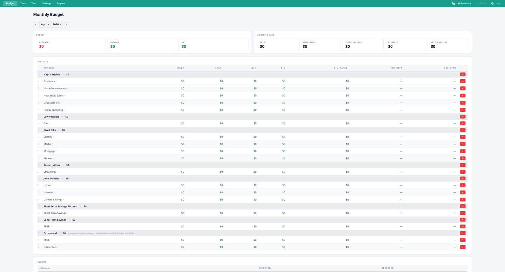
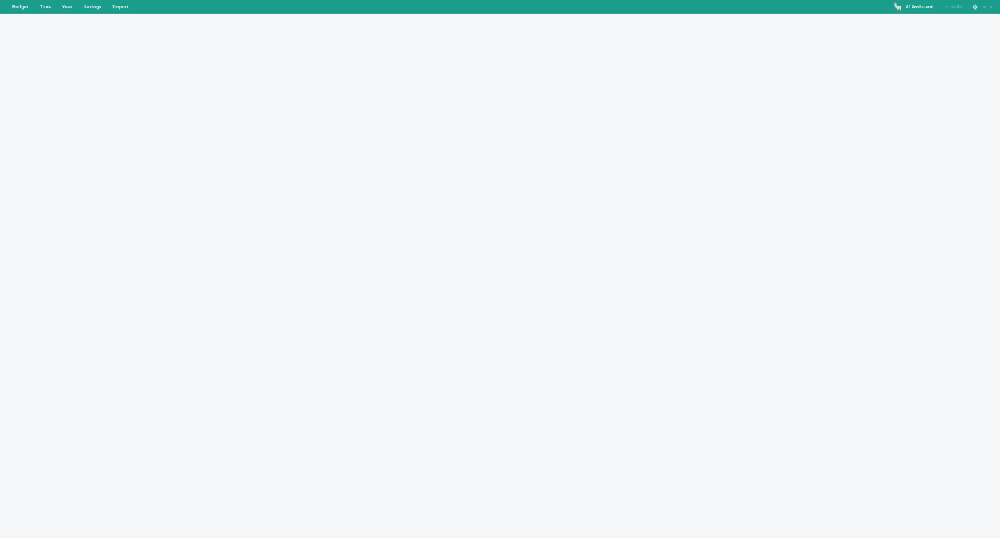
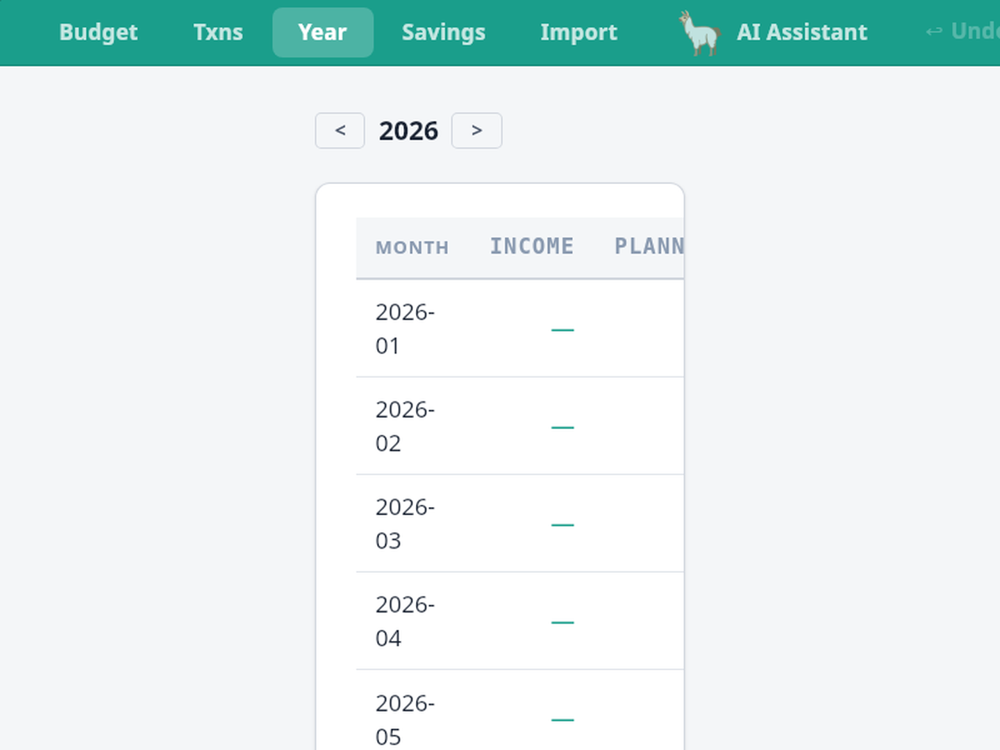
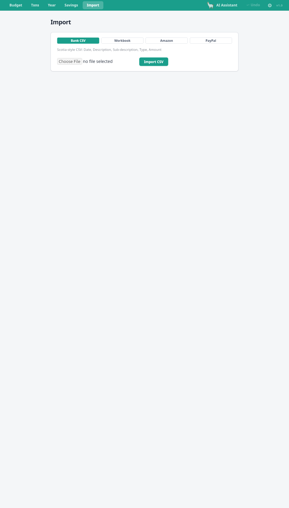

# qbdgt

A personal budgeting desktop app built with Tauri + React. All data stays on your machine — stored as a local JSON file, no accounts, no cloud sync.



## Features

- **Monthly budget** — set targets per category, track spent vs. remaining, see YTD totals and averages
- **Category groups** — organise categories into groups (High Variable, Fixed Bills, Subscriptions, etc.)
- **Transactions** — import, categorise, search, and annotate transactions
- **Year view** — month-by-month income and spending summary
- **Savings tracking** — buckets with scheduled contributions and balance history
- **CSV import** — import from bank CSV exports, spreadsheet workbooks, Amazon order history, or PayPal
- **AI assistant** — local LLM via [Ollama](https://ollama.com); answers questions about your budget, categorises transactions, and writes import parsers. No data leaves your machine.

## Screenshots

| Budget | Transactions | Year | Import |
|--------|-------------|------|--------|
|  |  |  |  |

## Getting started

### Prerequisites

- [Node.js](https://nodejs.org) 18+
- [Rust](https://rustup.rs) (for Tauri)
- [Tauri prerequisites](https://tauri.app/start/prerequisites/) for your OS

### Run in development

```bash
npm install
npm run tauri:dev
```

### Build a release

```bash
npm run tauri:build
```

The installer is written to `src-tauri/target/release/bundle/`.

## AI assistant setup

The AI assistant runs entirely locally using Ollama.

1. Install [Ollama](https://ollama.com)
2. Open **Settings → AI Assistant** and pull a model (recommended: `qwen2.5:7b`, ~4.7 GB VRAM)
3. Click the **AI Assistant** button in the top bar to open the chat panel

The assistant can answer questions about your budget, recategorise transactions, create auto-categorisation rules, and generate parsers for new import formats.

## Data

Your budget is stored as a single JSON file that you choose when first launching the app. You can back it up, version it, or move it between machines like any other file.

## Tech stack

- [Tauri 2](https://tauri.app) — desktop shell
- [React 19](https://react.dev) + TypeScript
- [Vite](https://vite.dev)
- [Chart.js](https://www.chartjs.org) — year view charts
- [xlsx](https://github.com/SheetJS/sheetjs) — spreadsheet import
